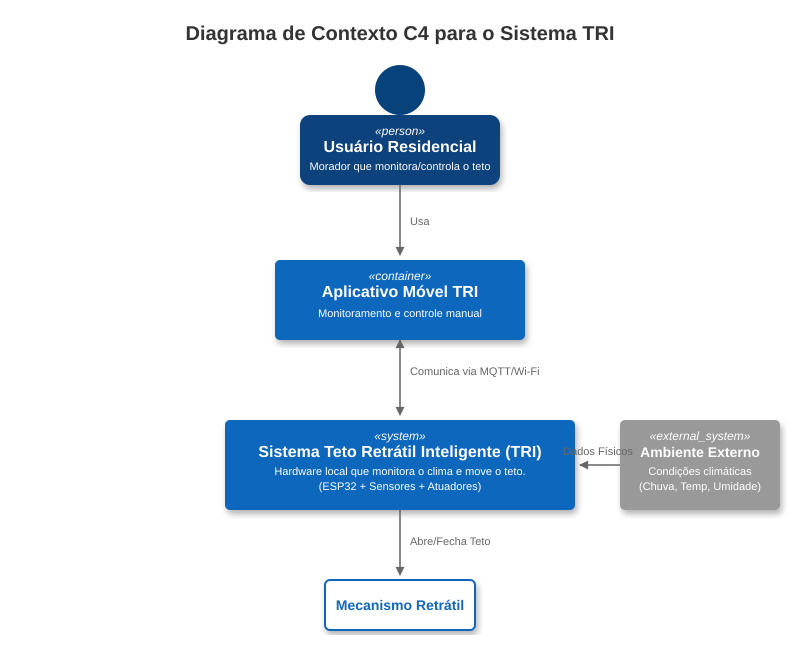
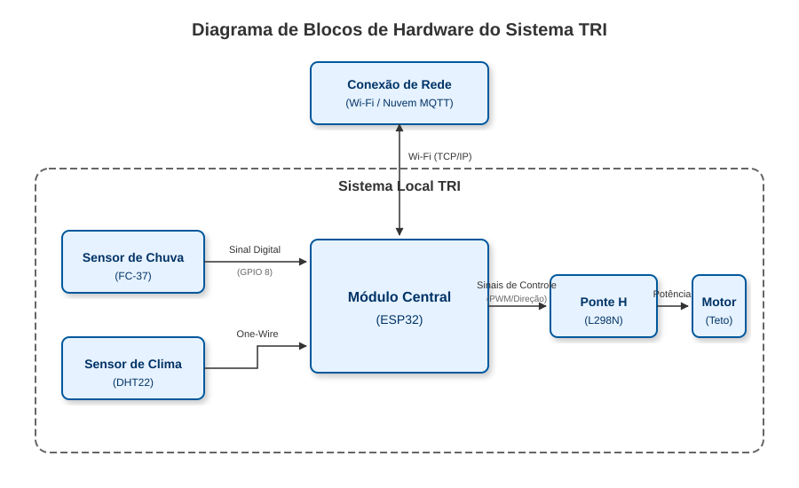
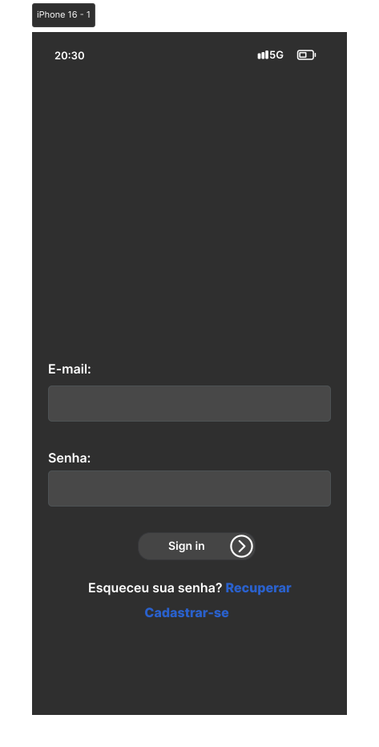
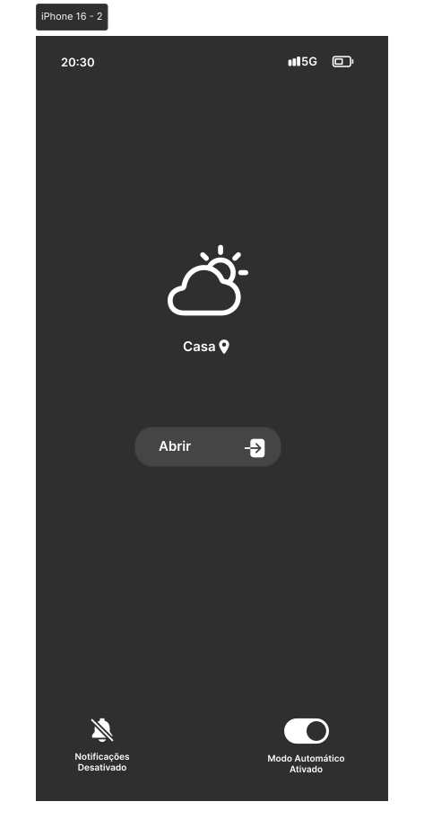
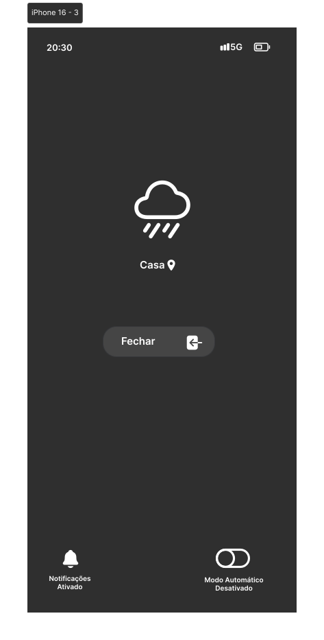

<div align="center">

# 🏠 Teto Retrátil Inteligente (TRI)

### Automação residencial com IoT para proteção do varal contra intempéries

*Projeto de Internet das Coisas (IoT) desenvolvido como requisito acadêmico no Centro Universitário Católica SC*

<p>
  
  
  
  
  
</p>

<p>
  
  
</p>

</div>

---

<div align="center">

### 🧭 Sumário

[Sobre o Projeto](#-sobre-o-projeto) • [Objetivos](#-objetivos) • [Funcionalidades](#-funcionalidades) • [Arquitetura e Hardware](#-arquitetura-e-hardware) • [Diagramas e Telas](#-diagramas-e-telas) • [Como Executar](#-como-executar) • [Equipe](#-equipe-de-desenvolvimento) • [Status](#-status-do-projeto)

</div>

---

## 📄 Sobre o Projeto

O **Teto Retrátil Inteligente (TRI)** é uma solução de automação residencial focada na proteção de roupas estendidas no varal contra intempéries. O sistema utiliza sensores ambientais para detectar chuva e umidade, acionando automaticamente uma cobertura retrátil. Além da automação, o projeto conta com um aplicativo móvel que permite o monitoramento em tempo real e o controle manual do teto.

## 🎯 Objetivos

<div align="center">

| Objetivo | Descrição |
|:---:|---|
| **Proteção** | Evitar que roupas se molhem durante chuvas inesperadas. |
| **Comodidade** | Automatizar o fechamento do teto sem necessidade de intervenção humana. |
| **Conectividade** | Permitir o controle remoto e notificação do usuário via app. |

</div>

## ✨ Funcionalidades

O sistema atende aos seguintes requisitos funcionais:

| Funcionalidade | Descrição |
|:---:|---|
| **Detecção Automática** | Monitoramento contínuo de chuva e umidade. |
| **Acionamento Automático** | Fechamento do teto ao detectar chuva. |
| **Controle Remoto** | Abertura e fechamento manual via aplicativo móvel. |
| **Monitoramento em Tempo Real** | Visualização de temperatura e umidade no app. |
| **Notificações** | Alertas sobre início de chuva e mudanças climáticas. |

## 🏗️ Arquitetura e Hardware

O projeto é baseado na arquitetura IoT (Sensoriamento, Processamento, Conectividade e Aplicação).

### Lista de Materiais

<div align="center">

| Componente | Modelo | Função |
|:---:|:---:|---|
| **Microcontrolador** | ESP32 | Processamento central e conectividade Wi-Fi/Bluetooth. |
| **Sensor de Chuva** | FC-37 | Detecção de gotas de chuva. |
| **Sensor de Clima** | DHT22 | Medição de temperatura e umidade relativa. |
| **Atuador** | Motor DC | Movimentação mecânica do teto. |
| **Driver de Motor** | Ponte H L298N | Controle de potência e direção do motor. |
| **Estrutura** | Trilhos/Hastes | Mecanismo físico da cobertura retrátil. |

</div>

### Tecnologias Utilizadas

- **Firmware:** C++ (Arduino IDE)
- **App/Interface:** Integração via protocolo MQTT / Plataforma estilo Blynk
- **Prototipagem de Interface:** Figma

## 🖼️ Diagramas e Telas

<div align="center">

#### Diagrama de Contexto
*Representa a interação entre o Usuário, o Ambiente Externo e o Sistema TRI.*




<br/>

#### Diagrama de Blocos (Hardware)
*Visualização das conexões entre ESP32, Sensores e Motor.*




<br/>

#### Interface do Aplicativo
*O aplicativo permite login, visualização do clima e botões de ação (Abrir/Fechar).*





</div>

## ⚙️ Como Executar

### Pré-requisitos

- Arduino IDE instalado
- Bibliotecas necessárias: `WiFi.h`, `DHT.h`, `PubSubClient` (para MQTT) ou biblioteca específica da plataforma IoT escolhida

### Instalação

**1.** Clone este repositório:

```bash
git clone https://github.com/MarieleV/teto-retratil-inteligente.git
```

**2.** Abra o arquivo `.ino` na Arduino IDE.

**3.** Configure as credenciais de Wi-Fi no código:

```cpp
const char* ssid = "SUA_REDE_WIFI";
const char* password = "SUA_SENHA";
```

**4.** Realize o upload para a placa ESP32.

## 📌 Status do Projeto

**Versão 0.1** — Protótipo Funcional.

<div align="center">

---

Teto Retrátil Inteligente (TRI) — Centro Universitário Católica SC

</div>
